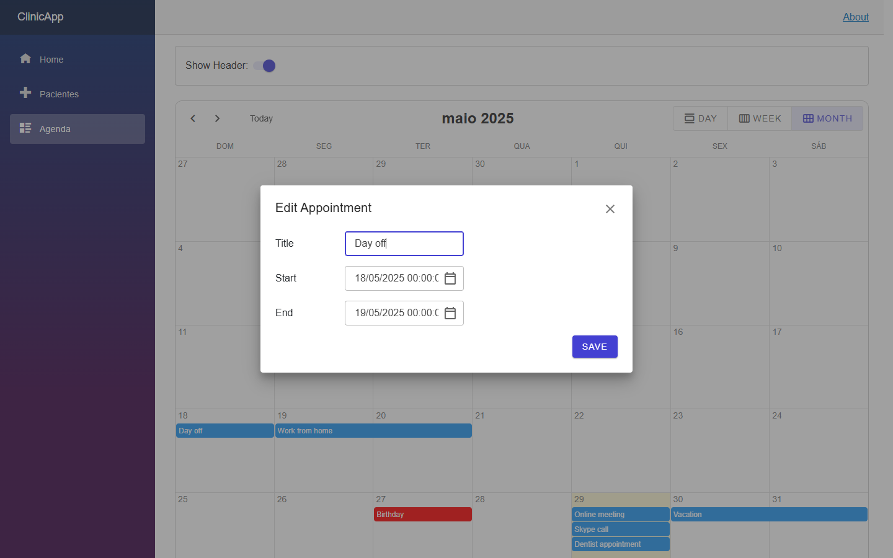
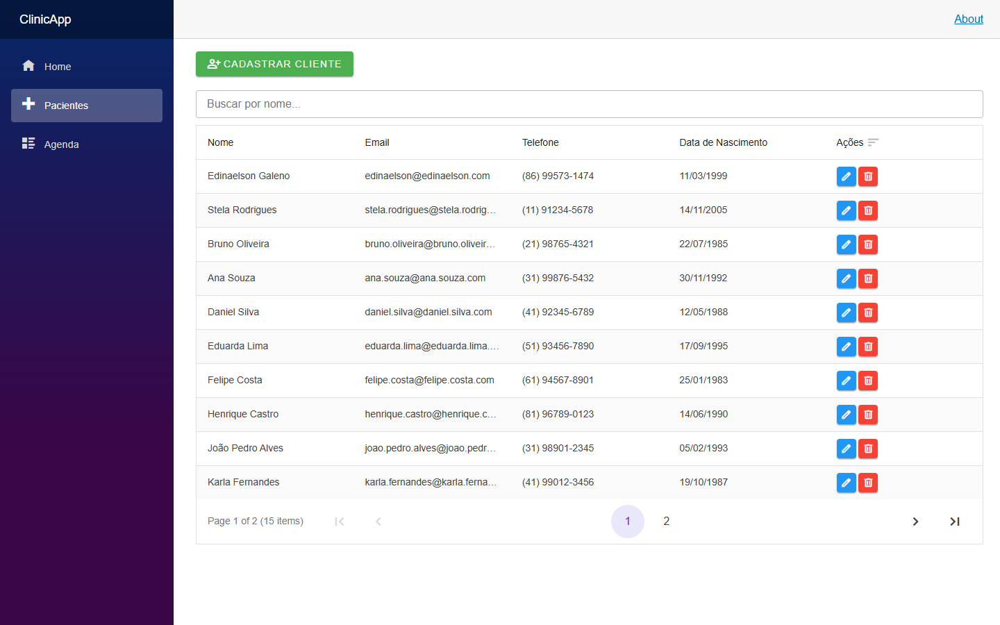
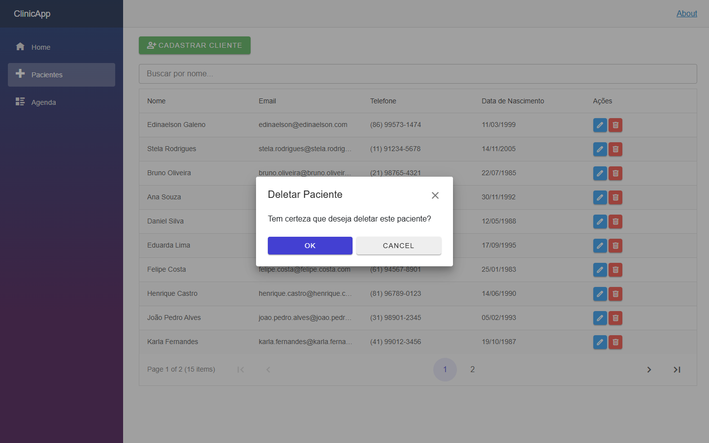
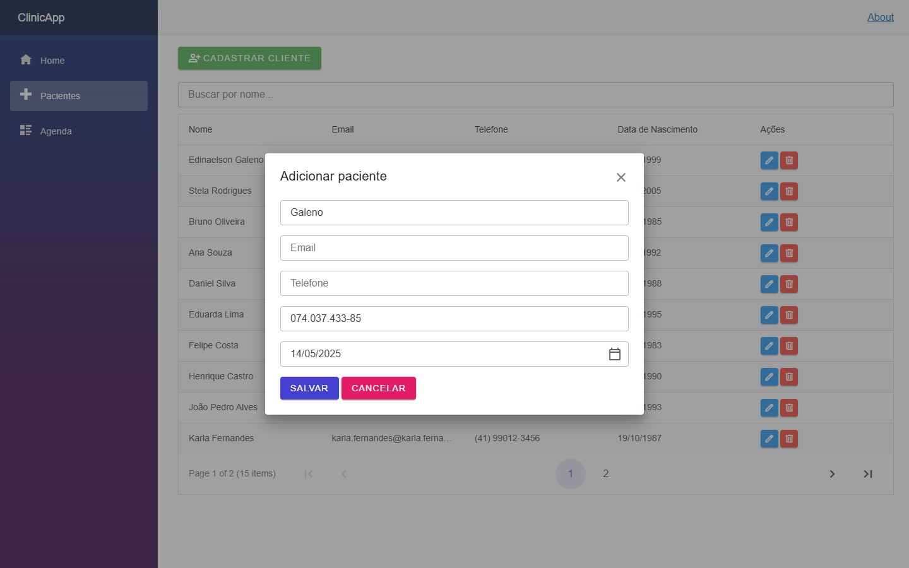
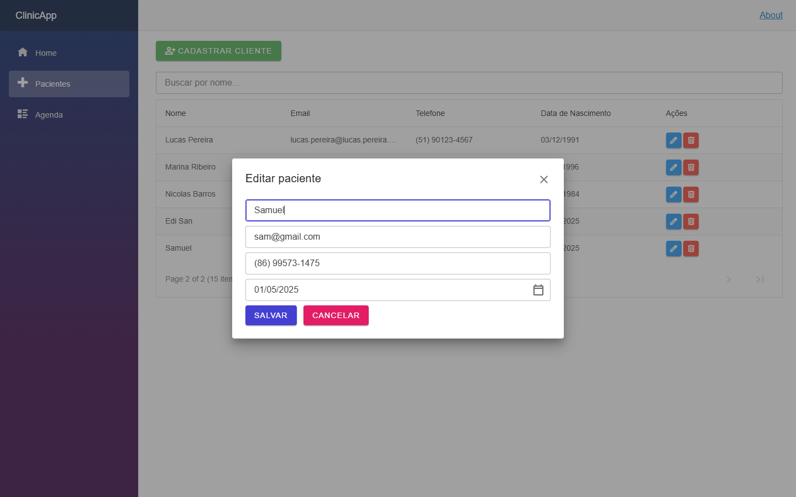

# 🗓️ ClinicApp - Sistema de Agendamento

Este é um sistema de agendamento de compromissos desenvolvido com **Blazor** usando componentes da biblioteca **Radzen**. O objetivo é fornecer uma interface moderna para controle de horários, incluindo visualização por dia, semana e mês.

---

## 🚀 Como iniciar o projeto

### Pré-requisitos

- [.NET 8 SDK](https://dotnet.microsoft.com/download)
- Visual Studio 2022 ou superior (ou VS Code com extensão C#)
- (Opcional) [Radzen Blazor Components](https://blazor.radzen.com/)

### Passos para rodar localmente

1. Clone o repositório:

   ```bash
   git clone https://github.com/Edinaelson/ClinicaApp.git
   cd clinicapp
   dotner run

## 🖼️ Capturas de Tela









